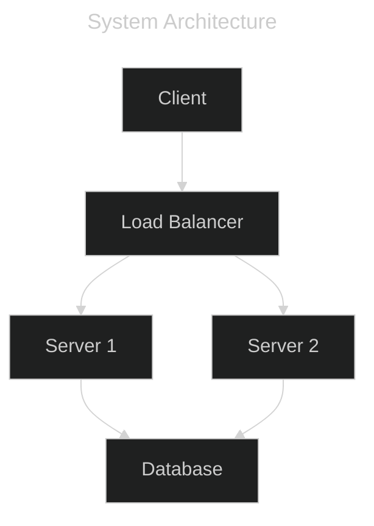

# Mermaid with Frontmatter Support

The base64 encoding approach correctly handles mermaid diagrams with frontmatter:

```mermaid
---
title: BDD Development Workflow
---
flowchart TD
    Business[Business Stakeholder&lt;br/&gt;Writes Feature]
    Dev[Developer&lt;br/&gt;Implements Steps]
    Execute[Execute Specification&lt;br/&gt;as Test]
    Pass{Test&lt;br/&gt;Passes?}
    Implement[Implement&lt;br/&gt;Feature Code]
    Done[Feature Complete&lt;br/&gt;Living Documentation]
    
    Business --&gt; Dev
    Dev --&gt; Execute
    Execute --&gt; Pass
    Pass --&gt;|No| Implement
    Implement --&gt; Execute
    Pass --&gt;|Yes| Done
    
    style Business fill:#9cf,stroke:#333,stroke-width:2px
    style Execute fill:#fc9,stroke:#333,stroke-width:2px
    style Done fill:#9f9,stroke:#333,stroke-width:2px
```

Another example with configuration:

